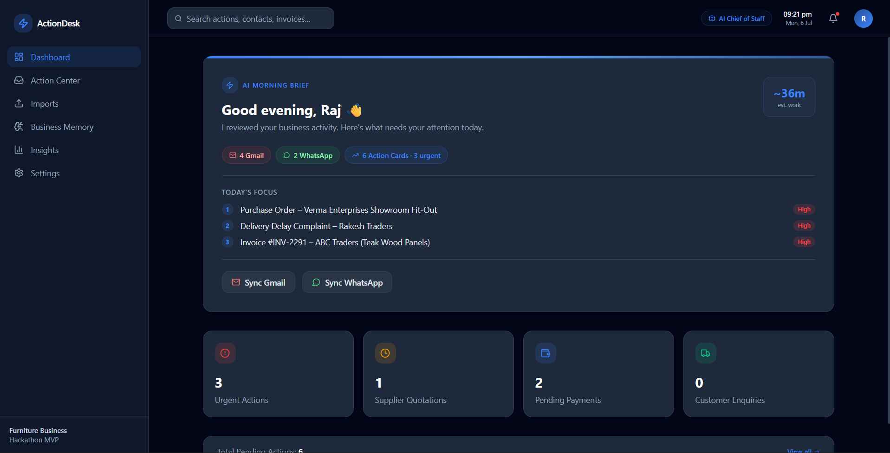
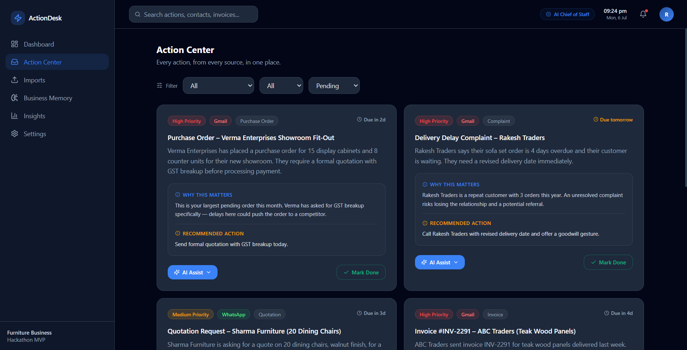

# 🚀 ActionDesk

> **AI Chief of Staff for Small Businesses**



---



> ActionDesk transforms scattered business communication into prioritized, actionable work. Instead of switching between Gmail, WhatsApp, invoices, and documents, business owners get one intelligent workspace that tells them exactly what needs attention.

---

## 📌 The Problem

Small businesses receive critical information from multiple sources every day:

- 📧 Gmail
- 💬 WhatsApp
- 📄 Invoices & Quotations
- 🧾 PDFs
- 🎤 Voice Notes

Managing these across different apps often results in:

- Missed follow-ups
- Delayed payments
- Forgotten customer requests
- Lost business opportunities
- Constant context switching

Existing tools organize messages.

**ActionDesk organizes work.**

---

# 💡 Our Solution

ActionDesk acts as an **AI-powered Chief of Staff**.

Instead of showing raw messages, it:

- Understands incoming communication using AI
- Extracts business context
- Converts everything into structured **Action Cards**
- Prioritizes urgent work
- Generates a Morning Brief
- Builds long-term Business Memory

### Core Philosophy

> **Everything is an Action.**

Emails aren't important.

WhatsApp messages aren't important.

Invoices aren't important.

**The work they create is what matters.**

---

# ✨ Features

### 🌅 AI Morning Brief

Start the day with an executive summary of everything received overnight.

- Communications processed
- Urgent actions detected
- Estimated work time
- Top priorities

---

### 📥 Unified Imports

Import business communication from multiple sources.

Current MVP supports:

- Gmail (Mock)
- WhatsApp (Mock)
- Text Input
- Invoice Upload
- Voice Transcript

Future Roadmap:

- Gmail API
- WhatsApp Business API
- OCR
- Live Voice Processing

---

### 🧠 AI Action Extraction

Every communication is transformed into a standardized Action Card.

Example:

```json
{
  "title": "Invoice from ABC Traders",
  "category": "Invoice",
  "priority": "High",
  "summary": "...",
  "recommended_action": "Pay before due date",
  "status": "Pending"
}
```

---

### 📋 Action Center

A unified workspace where users can:

- Filter actions
- View priorities
- Mark tasks complete
- Receive AI recommendations

---

### 🗂 Business Memory

Completed actions become searchable business knowledge instead of disappearing forever.

---

### 📊 Business Insights

Gain visibility into:

- Pending Payments
- Communication Sources
- Business Categories
- Upcoming Deadlines

---

# 🏗️ Tech Stack

| Layer | Technology |
|--------|------------|
| Frontend | Next.js 14 (App Router) |
| Styling | Tailwind CSS |
| AI | Groq API (`openai/gpt-oss-120b`) |
| Speech | Groq Whisper (`whisper-large-v3`) |
| Backend | Next.js API Routes |
| Storage | In-Memory Store (Demo MVP) |

---

# ⚙️ Architecture

```
Gmail / WhatsApp / Invoice / Voice
                │
                ▼
         Text Extraction
                │
                ▼
          Groq AI Analysis
                │
                ▼
      Standardized Action Card
                │
                ▼
 Dashboard • Action Center • Insights
```

---

# 📁 Project Structure

```
app/
├── Dashboard
├── Action Center
├── Imports
├── Business Memory
├── Insights
├── Settings

components/
├── ActionCard
├── Sidebar
├── Header
├── KPI Cards

lib/
├── Groq Integration
├── Schema
├── Store
├── AI Assist
├── Mock Sources
```

---

# 🚀 Getting Started

```bash
git clone <repository-url>

npm install

cp .env.local.example .env.local
```

Add your Groq API Key

```
GROQ_API_KEY=YOUR_KEY
```

Run

```bash
npm run dev
```

Visit

```
http://localhost:3000
```

---

# 🧪 MVP Scope

| Feature | Status |
|---------|--------|
| Gmail Sync | ✅ Mocked |
| WhatsApp Sync | ✅ Mocked |
| AI Extraction | ✅ Real (Groq) |
| Invoice Upload | ✅ Supported |
| Voice Transcript | ✅ Supported |
| Business Memory | ✅ Implemented |
| Insights Dashboard | ✅ Implemented |
| OCR | 🚧 Planned |
| Live Gmail API | 🚧 Planned |
| WhatsApp Business API | 🚧 Planned |

---

# 🎯 Future Roadmap

### Version 1.5

- Business Memory Improvements
- Customer Profiles
- Search

### Version 2.0

- OCR
- Voice Upload
- Receipt Scanner

### Version 2.5

- Gmail API
- WhatsApp Business API
- Google Calendar

### Version 3.0

ActionDesk evolves into a true AI Operations Agent capable of:

- Drafting replies
- Scheduling meetings
- Creating reminders
- Triggering business workflows automatically

---

# 🌟 Why ActionDesk?

ActionDesk doesn't replace Gmail.

It doesn't replace WhatsApp.

It doesn't replace your ERP.

It becomes the **intelligence layer above them**, transforming fragmented communication into prioritized business actions.

---

# 👨‍💻 Built For

**Hackathon MVP**

Designed to demonstrate how AI can simplify operations for small businesses by turning scattered communication into clear, prioritized work.

---

## ⭐ If you like this project, consider giving it a star!
